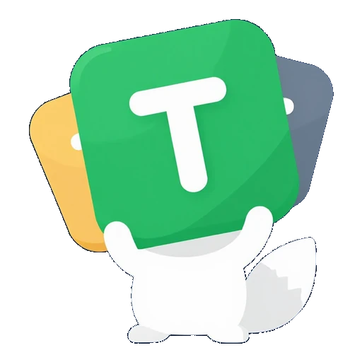

<div align="center">
  
  <h1>Tech-dle</h1>
  <p><strong>Wordle for technologies.</strong> Guess the language, framework, database or tool of the day in 6 attempts.</p>
  <p>
    <a href="https://tech-dle.vercel.app/">Play it live</a>
    ·
    <a href="https://github.com/MiguelJiRo/Tech-dle/issues">Report issue</a>
  </p>
  
</div>

---

## Highlights

- **Daily puzzle** with 6 attempts and rich, multi-tier hints.
- **127 technologies** spanning languages, frameworks, databases and tools — from COBOL to Bun.
- **6 languages** out of the box (English, Spanish, Portuguese, French, German, Italian) with browser auto-detection and a language switcher.
- **Light, dark and system themes** with no flash on first paint.
- **Color-blind mode** that adds symbols to every cell so the result is readable without relying on color.
- **Hard mode** that enforces previous hints on subsequent guesses.
- **Hint system** that reveals one categorical clue after 4 failed attempts.
- **Year tolerance ranges**: exact / within 5 years / within 20 years / further — each with directional arrows.
- **Archive mode** to replay any past puzzle, plus deep links (`?d=YYYY-MM-DD`) so friends can play the same one.
- **Countdown** to the next daily puzzle, **confetti** on win (lazy-loaded, respects `prefers-reduced-motion`).
- **Achievements** with 10 unlockable badges and a **history view** of the last 60 daily games.
- **Stats**: streaks, win %, attempt distribution, share results with emoji grid.
- **Accessibility**: focus-trapped modals, ARIA roles, live regions, skip-to-content, dynamic `<html lang>`.
- **Installable PWA**: web manifest, OG/Twitter cards, sitemap, JSON-LD, `<noscript>` fallback.
- **Robust storage**: tolerant to private mode, quota errors and corrupt data.

## How to play

1. Type a technology name into the input. Filter by **type** with the pills above the input.
2. Pick a suggestion (the matching substring is highlighted).
3. Read the hints in each cell:
   - 🟩 **Green** — exact match.
   - 🟨 **Yellow** — partial match (e.g. *Multi-paradigm*) or year within ±5.
   - 🟧 **Orange** — year off by 6 to 20 (with ↑ / ↓ arrow).
   - ⬛ **Gray** — no match, or year more than 20 years off.
4. Use the information to refine your next guess.

The four compared attributes are **year**, **type**, **paradigm** and **typing**.

## Tech stack

- **React 19** + **Vite 8** with code-splitting and lazy-loaded modals.
- **Tailwind CSS 3** with `darkMode: 'class'` and full light/dark variants.
- **Vitest** for unit testing (104 tests, run on every PR by GitHub Actions).
- **canvas-confetti** for the win celebration (loaded on demand only).
- **No backend** — everything runs in the browser, persisted to `localStorage`.

## Getting started

```bash
npm ci          # install dependencies
npm run dev     # start the dev server
npm test        # run the test suite
npm run lint    # lint with eslint
npm run build   # production build
npm run preview # preview the production build
```

Node 22 is recommended (matches the CI version).

## Project structure

```
Tech-dle/
├── .github/
│   ├── workflows/ci.yml        # Lint, test and build on PRs and main
│   └── dependabot.yml          # Weekly grouped npm + actions updates
├── public/                     # Favicons, manifest, OG image, robots, sitemap
├── src/
│   ├── components/             # UI components
│   │   ├── Header.jsx          # Sticky header with language dropdown
│   │   ├── GuessGrid.jsx       # Wordle-style flip grid
│   │   ├── TechnologyInput.jsx # Autocomplete with type filters
│   │   ├── HintPanel.jsx       # Hint button + revealed clues
│   │   ├── Countdown.jsx       # Time until next puzzle (UTC)
│   │   ├── Modal.jsx           # A11y modal (focus trap + ARIA)
│   │   ├── StatsModal.jsx      # Stats, share, achievements panel
│   │   ├── HelpModal.jsx
│   │   ├── SettingsModal.jsx   # Theme + color-blind + hard mode toggles
│   │   ├── ArchiveModal.jsx    # Browse and replay past puzzles
│   │   ├── HistoryModal.jsx    # Last 60 daily games
│   │   ├── TechIcon.jsx        # Type icons
│   │   ├── ColorGuide.jsx
│   │   └── Footer.jsx
│   ├── data/
│   │   └── technologies.js     # The 127-entry dataset + day picker
│   ├── i18n/                   # Translations + provider + dropdown source
│   │   ├── es.js / en.js / pt.js / fr.js / de.js / it.js
│   │   ├── languages.js        # SUPPORTED_LANGUAGES catalog
│   │   ├── context.js          # React context shell
│   │   ├── LanguageContext.jsx # Provider
│   │   └── useLanguage.js      # Hook
│   ├── settings/               # Theme, color-blind, hard mode
│   ├── toast/                  # Toast provider + hook
│   ├── utils/
│   │   ├── gameLogic.js        # compareYear / compareField / hard mode
│   │   ├── achievements.js     # 10 achievements + diff helpers
│   │   ├── confetti.js         # Lazy-loaded win burst
│   │   └── storage.js          # localStorage helpers (tolerant)
│   ├── App.jsx
│   ├── main.jsx
│   └── index.css
├── index.html                  # Inline theme bootstrap + SEO meta
├── package.json
├── vite.config.js
├── tailwind.config.js
├── postcss.config.js
└── eslint.config.js
```

## Customizing

### Add a technology

Append a new entry to [`src/data/technologies.js`](src/data/technologies.js):

```js
{
  id: 128,
  name: "MyTech",
  year: 2024,
  type: "Framework",          // Lenguaje | Framework | Base de Datos | Herramienta
  paradigm: "Declarativo",    // Multi-paradigma | Orientado a Objetos | Funcional | Imperativo | Declarativo
  typing: "Estático"          // Estático | Dinámico | Gradual | No aplica
}
```

The dataset integrity test will validate the shape on `npm test`.

### Add a language

1. Copy [`src/i18n/es.js`](src/i18n/es.js) to `src/i18n/<code>.js` and translate every value.
2. Register it in [`src/i18n/LanguageContext.jsx`](src/i18n/LanguageContext.jsx) and append it to [`src/i18n/languages.js`](src/i18n/languages.js).
3. The parity test in `src/i18n/locales.test.js` will fail if any key is missing or empty.

### Tune game parameters

- Year tolerance thresholds: `YEAR_NEAR_THRESHOLD` and `YEAR_FAR_THRESHOLD` in [`src/utils/gameLogic.js`](src/utils/gameLogic.js).
- Hint trigger: `HINT_THRESHOLD` and `MAX_HINTS` in [`src/components/HintPanel.jsx`](src/components/HintPanel.jsx).
- History cap: `HISTORY_LIMIT` in [`src/utils/storage.js`](src/utils/storage.js).
- Max guesses per round: the `maxGuesses` prop on `<GuessGrid>` in [`src/App.jsx`](src/App.jsx).

## Deploying

The app is a static SPA. The current production target is [Vercel](https://vercel.com/), but anywhere that can serve `dist/` works (Netlify, Cloudflare Pages, GitHub Pages…).

```bash
npm run build
# upload the dist/ directory
```

## License

[MIT](LICENSE) — see the LICENSE file.

## Credits

Built by [@MiguelJiRo](https://github.com/MiguelJiRo). Inspired by Wordle and the daily-guessing-game family it spawned.
